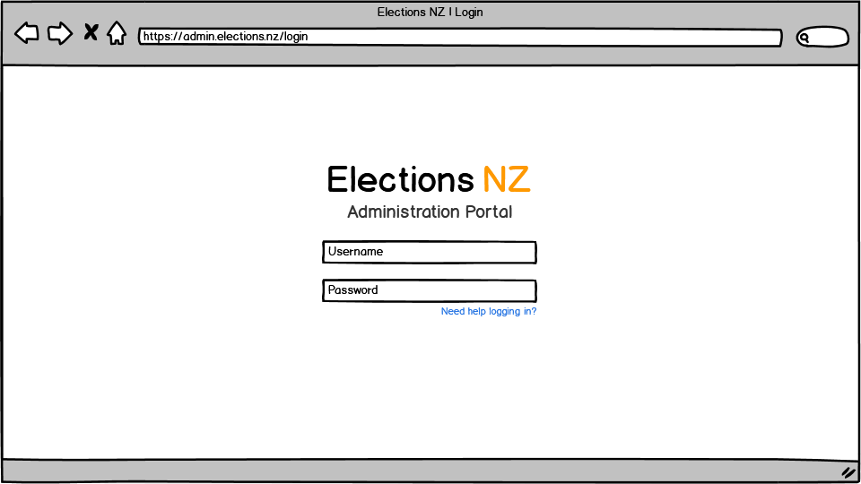
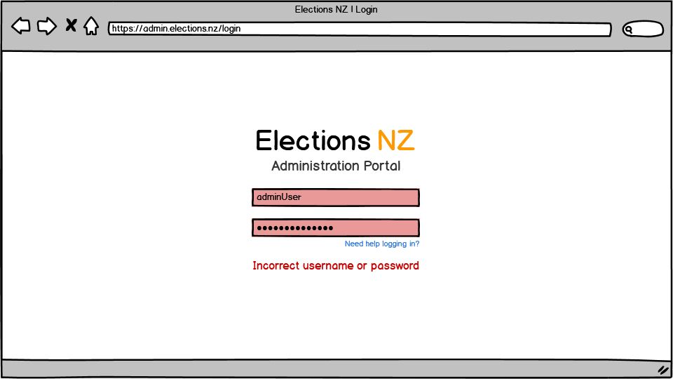
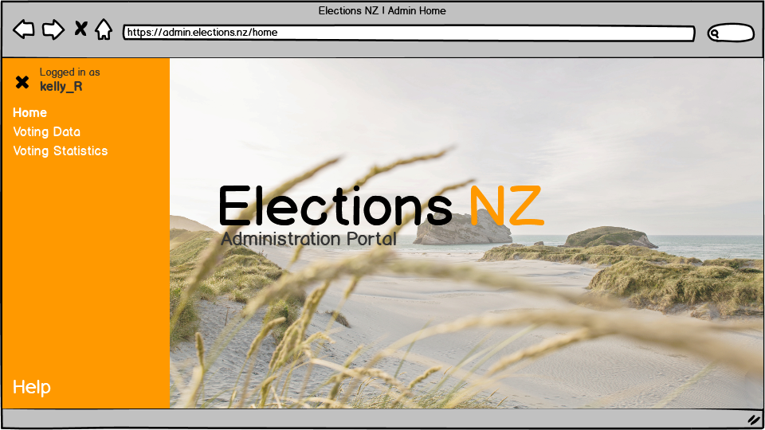
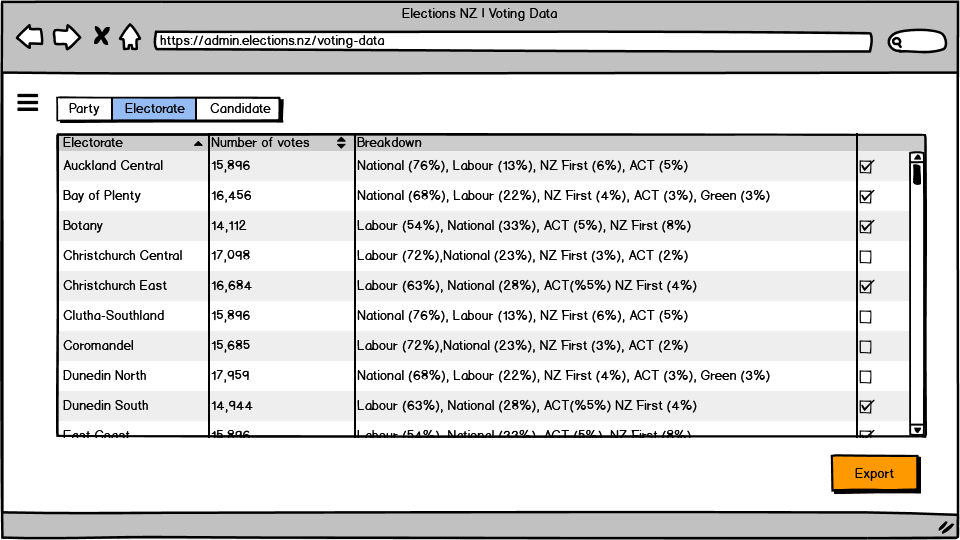
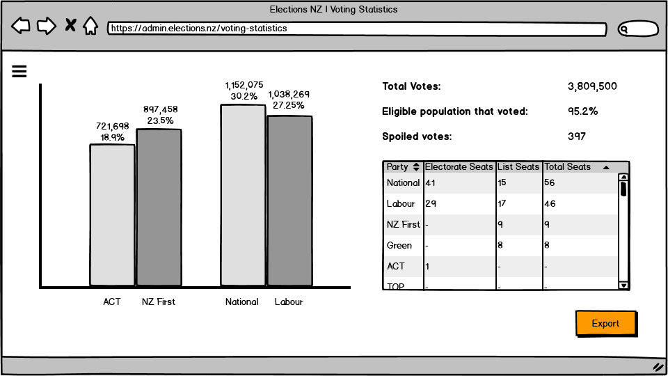

# Admin Pages
An effort was made to make the administration pages as simple and clear as possible. Often administration software/websites are clunky, aged, or cluttered, and so here only the minimum amount of elements have been included. As more discussion with the client continues, further requirements may be added to the project and so more elements might be necessary. 
Election NZ orange is used throughout, as well as subtle darker greys in places to provide contrast and reduce eye strain. 
The primary user persona throughout is [Danielle (System Administrator)](Personas/PersonaOne/Danielle.md). There are no other users from the personas identified.  

**Admin Log-In** 
The login page is very simple and includes a link (in hyperlink blue) to get login help.  
*Tasks involved*: Admin logs in  
  

**Admin Failed Log-In** 
Red highlighting and text indicates a failure. Both boxes are highlighted regardless of whether the username or password are incorrect to prevent username enumeration. The use of an error message text provides explicit feedback as to what has occurred.  
*Tasks involved*: Admin logs in  
  

**Admin Homepage** 
The home page starts with the orange side menu open. The menu indicates who is logged in, with the name being clickable and leading to a profile management page. It can be closed with the ‘X’, and re-opened by the ‘hamburger’ icon, as seen on the next two pages. 
The side menu also has a link to the home page (which is the current page, as indicated by the link being in bold), and links to the two remaining pages detailed in this design. Other links that may be needed on the site would also be present on this side menu. There is a larger ‘help’ link at the bottom. 
A quintessential NZ image is used as the background to reinforce a focus on NZ as a country, and a reminder this is a national service.  
*Tasks involved*: N/A  
 
Note: image is "Seashore" (South Island NZ) by Nathan Cowley, https://www.pexels.com/photo/seashore-2506638/, Free to use, no attribution.  

**Admin Views Voting Data** 
This is where detailed statistics can be viewed. Different tabs show tables organised by party, electorate, and candidate. Tables can be sorted by the different columns. Data can be selected using the checkboxes (keyboard+mouse based selection would also be supported) and exported using the ‘export’ button. This will open a standard system save dialogue and will have a number of filetype options (.csv, .xlsx, etc). 
As discussed, the ‘hamburger’ icon opens up the navigation side menu. The browser back/forward buttons can also be used.  
*Tasks involved*: Admin views collected data, Admin records data to external file  
  

**Admin Views Statistical Data** 
This page presents the statistics and data in summary graphs and tables. The ‘export’ button will allow these to be saved as individual images, compiled into a PDF, or exported in the same way as the Voting Data page (.csv, .xlsx, etc). The filetype chosen will determine the export method. 
Navigation to other pages is also the same as the Voting Data page.  
*Tasks involved*: Admin views voting statistics, Admin records statistics to external file  
  

*Alex wrote and designed all Admin Pages*