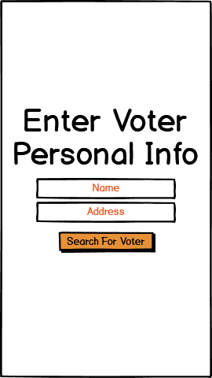
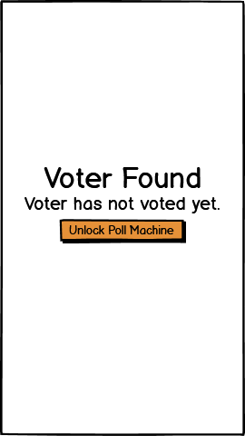
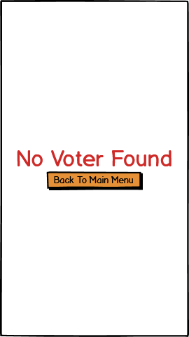
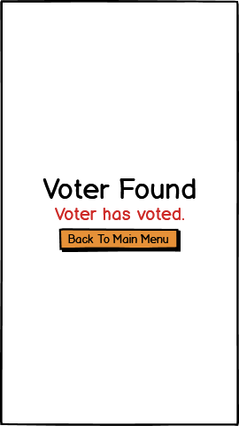

# Voter Authentication/Authorisation Pages
The design of the authentication/authorization pages is linear and simple to make the process of a voter 'registering' as easy as possible while avoiding confusion. The main colour used is orange, in theme with Elections NZ. Buttons are orange to indicate that they can be interacted with (i.e. tapped). Red text was used to indicate that something went wrong with the search (i.e. voter not found). 

*Personas involved*: Xander (Voting Station Supervisor) 
*Tasks involved*: [Voter verification](Scenarios/TaskSix.md)  

**Verify Voter Information** 
This is the first page that the voting station supervisor can interact with. When a voter approaches and provides their name and address, the supervisor can enter the details provided and then search for the voter.  
  

**Voter Exists & Has Not Voted** 
This is the page that indicates a voter was found after a search, and that the person has not voted yet. The supervisor can unlock a poll machine, which the voter can approach and place their vote. When the supervisor goes back to the first page, the voter who was found in the search is recorded as having voted now.  
  

**Voter Does Not Exist** 
This is the page that appears if a voter was not found from the search. The supervisor can then go back to the first page, and search again if they wish (i.e. potential spelling mistake).  
  

**Voter Has Voted** 
This is the page that appears if a voter was found but has been recorded to have voted already. The supervisor can then go back to the first page.  
  

*Logan wrote and designed all Voting Auth Pages*