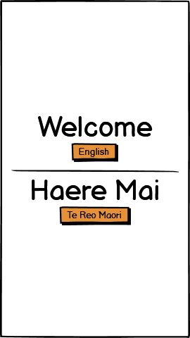

# Voting Pages
The design of the voting pages is linear and simple to make the voting experience as easy as possible while avoiding confusion. The main colour used is orange, in theme with Elections NZ. Buttons are orange to indicate that they can be interacted with (i.e. tapped), while highlighted text is orange to draw the user's attention to the important information. The different shades of orange were selected from http://colorsafe.co to ensure that the highlighted text followed standards for accessibility (i.e. to ensure the highlighted text is easy to read). Red text was used to warn the user of their following actions.  

*Personas involved*:
- [Devrim (Young adult Voter)](Personas/PersonaTwo/Devrim.md)
- [Karen (Middle-aged Voter)](Personas/PersonaThree/Karen.md)
- [Doug (Elderly Voter)](Personas/PersonaFour/Doug.md)
  

*Tasks involved*: 
- [Voter casts vote](Scenarios/TaskTwo.md)
- [Voter alters vote mid-voting process](Scenarios/TaskThree.md)
- [Voter alters vote before ballot submission](Scenarios/TaskFour.md)
- [Voter spoils ballot as a protest vote](Scenarios/TaskFive.md)
  

**Voter Welcome Screen** 
This is the first page that the voter interacts with. As they approach a poll station, they must select a language before they proceed in the voting process. (Note that English is used for the other page designs.)  
  

**Voter Begins Voting** 
On this page, the voter must choose whether they wish to place a vote or spoil their ballot (as some people do as a form of political protest).  
  

**Party/Electorate Vote** 
These two pages are where the voter places their two votes. They have been carefully designed to be clear and concise, while presenting the necessary information to make a vote selection. The design includes highlighted explanation text, a button to continue (once a selection has been made), and a simple list of vote options (including party logos).  

  

**Confirm Party/Electorate Vote** 
These two pages are where the voter confirms their vote for each category, and they follow their respective voting pages. They are crucial to ensure that the voter is sure about their vote selection. On these pages, the voter may go back and select a different vote, or the voter can confirm their selection.  
  
  

**Confirm Ballot Is Finished** 
This page follows both voting pages. It is crucial to ensure the voter is confident in both their vote selections, in addition to giving the voter a final chance to check that their votes were recorded correctly. This page allows them to go back and select a different vote for a category, or to confirm their votes. Note the red warning text to ensure the voter is aware of the finality of their confirmation.  
  

**Confirm Ballot Submission** 
This is the final page that the voter interacts with after they have submitted their votes.  
  

**Confirm Spoiling Ballot** 
This is the page a voter is shown if they selected to spoil their ballot on the welcome screen. From this page, they may change their mind and place a vote, or they may confirm their decision to spoil their vote. Note the red warning text to ensure the voter is aware of the finality of their confirmation.  
  

**Confirm Spoiled Ballot Submission** 
This page is the final page a voter is shown if they confirm that they wish to spoil their ballot.  
  

*Logan wrote and designed all Voting Pages*