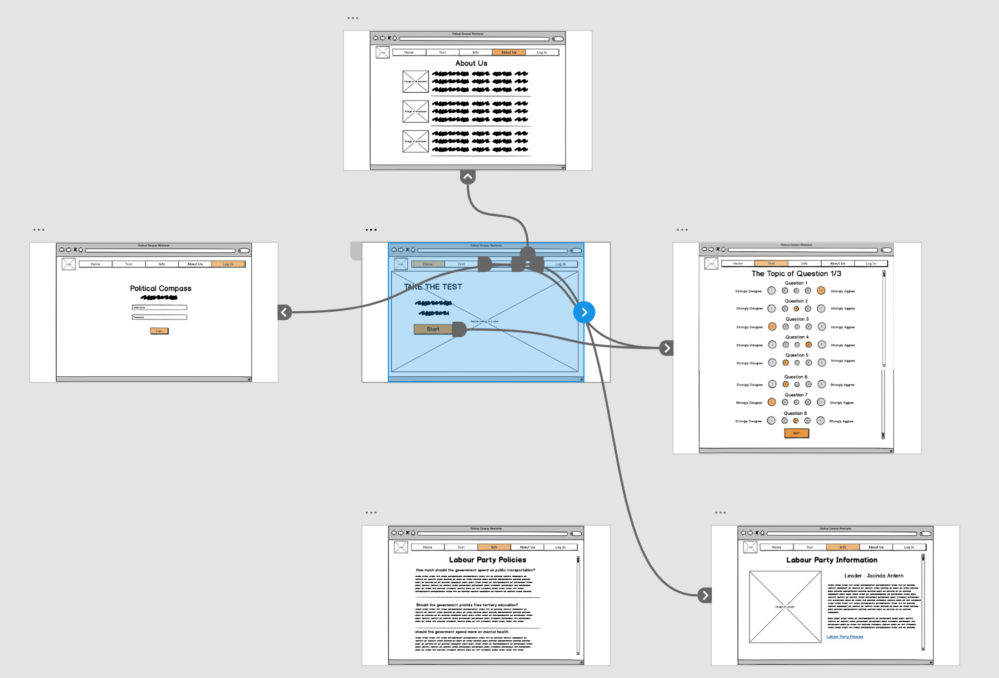
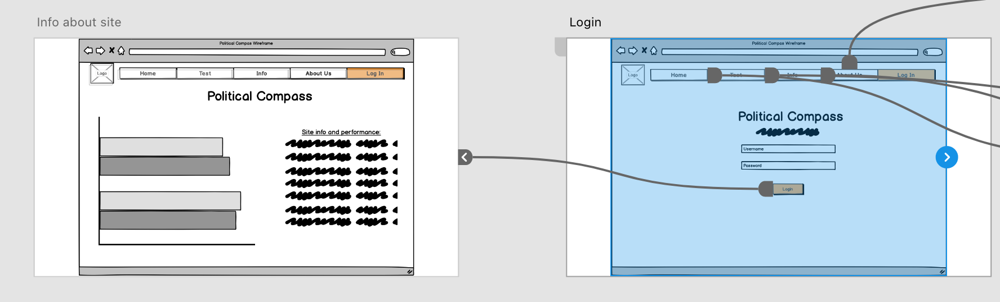
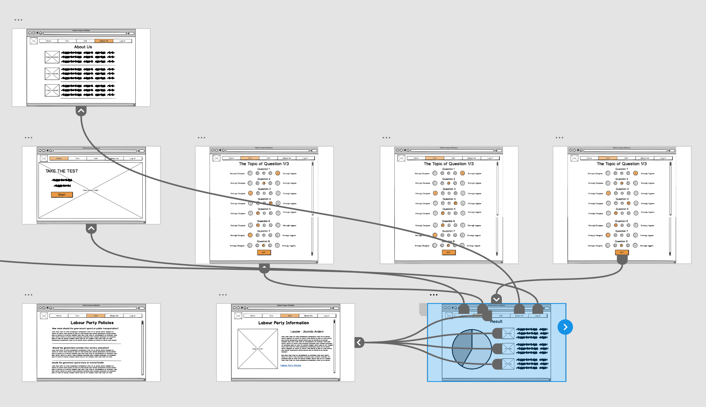
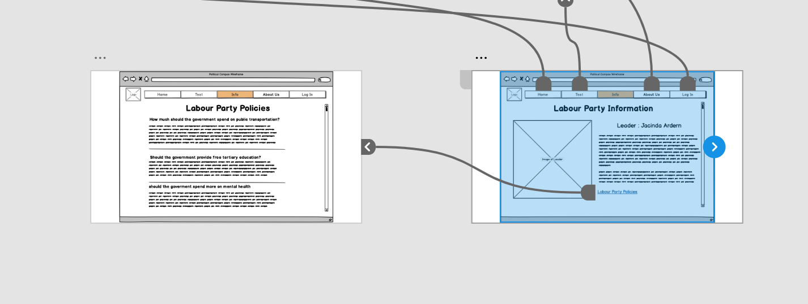

### Group Members
- Logan (brantlloga - 300444876)
- William (torkinwill - 300418943)
- Harrison (comptoharr - 300473595)
- Caitlin (goodgecait - 300412363)
- Fabian (faganfabi - 300456734)
- Rose (sharkerose - 300441100)
   
# Project Background
### Description – Political Compass
A Political Compass is an important tool for the user to interact with so that the user can see the overlap between their own political views and the political parties’. It can also be used to see the current policies of each party and how they compare. In New Zealand there are a number of parties that all have policies on a range of topics. The user is able to complete a survey and the system calculates how closely each of the parties matches the user’s answers. The user is also able to see each party and their policies and what their opinions on the topics are. The system is also able to display the policies for each of the party so that the user can do their own research into each party without having to complete the survey. 

There are multiple existing solutions out there such as www.politicalcompass.org. This Political Compass is more general rather than focusing on parties and their policies. The user answers 6 pages of questions, on a range of topics before the system calculates the user’s results. The results are displayed as a graph with two axes. One from left to right and the other from Authoritarian to Libertarian. This solution is more focused on understanding where the user stands rather than educating them on how to vote for an upcoming election. It is also slightly complicated to understand and there is a lot explanation before the user’s results so they can understand what it means. 

There is an existing solution that is closer to what I am proposing and related to New Zealand, https://newzealand.isidewith.com/. The user, once again, takes a survey about their views on current topics. At the moment, the first question is about the legalisation of Marijuana. Once the user has completed the survey, the system calculates how closely the user’s answers match each Political Party. From there, the user can see which Party agrees with which of their survey answers. They can also see each Party and their policies. 

### Business Objectives
People want to be able to make an educated vote. It can be hard to know or understand how their views align with the political parties. The Political Compass must be able to help the user understand who the best party for them to vote for is. There must be a survey that the user can take to be able to meet the goal of being able to make an educated vote. This means that it should clearly show how their views align with the political parties and by how much. It also needs to be readable and understandable by people with less political knowledge and doesn’t require a lot of explanation. 

The Political Compass must also be able provide information to the user about all the parties and their policies. This is important for the user so that they can do some of their own research without taking the survey. This would allow the user to be able to find information that they want to know. 

For this business case, the main objectives for the Political Compass:
- Provide the user with a clear indication of how much their views align with the political parties
- Provide information about all the Political Parties and their policies
- Provide all the information in an easy way to read and understand. 

### Importance for Stakeholders
This system is a way for users to understand Political parties and their policies. It will help them to become more educated and be able to vote with confidence. It is extremely important as elections affect who is running the country. Thus, the system is vital to users becoming properly informed. People of a wide range of political knowledge and computer illiteracy are going to be interacting with the system, so it is important that it is easy and simple to use.  

# Personas and Scenarios
### Personas
- [Persona 1 - Isabella](Personas/Isabella.md) 
- [Persona 2 - Karen](Personas/Karen.md) 
- [Persona 3 - William](Personas/William.md) 
- [Persona 4 - Lincoln](Personas/Lincoln.md) 
- [Persona 5 - Danielle](Personas/DanielleCarter.md) 

When we looked at all the different personas that each member of the group had in assignment 2, we noticed some overlap in characteristics but also some diversity. The majority of the members had personas separated by a combo of age and technical proficiency. In addition, Logan and William had an admin persona each. Therefore, our initial goal was to merge the personas into a balanced combination of our existing personas. The final combination we decided on was a young persona with high technical proficiency, two middle-aged personas with different levels of system knowledge, an elderly persona with low technical proficiency, and an admin persona.

The young persona was a combination of several different young personas from A2, which were similar for the most part. For instance, they were aged at approximately 20 years old so that this would be their first time voting, giving an important characteristic to consider. They were also all technically proficient to represent users who are comfortable with most software systems.

Karen, one of the middle-aged personas, came directly from Logan's A2 report, as she represents users who are knowledgable in the political domain but not knowledgable in the system domain of political compass systems. William was created to represent users who are knowledgable in the political domain and has some experience using a political compass systems. Both of these personas represent users who have basic technical proficiency but would struggle to interact with advanced systems without dedicated training around system use.

The elderly persona was taken directly from Rose's A2 report, as she was the only member to already have an elderly persona. We felt that the persona was an adequate representative of a user with very low technical proficiency and a lifetime of political domain knowledge. In particular, this user excellently represents users who have the bare minimum technical proficiency to browse the internet and struggle to do much more than that.

The admin persona was a combination of Logan and William's admin personas from A2. The persona represents admin users who can use basic software systems and have extensive political domain knowledge. This user primarily informed the design for the statistics page about all the user results and the site performance, which an admin user can access by logging in.

### Scenarios
- [Scenario 1 - User views *About* page](Scenarios/AboutPage.md) 
- [Scenario 2 - User views *Parties' Policies on Topic* page](Scenarios/PartiesPolicy.md) 
- [Scenario 3 - User views *Party's Policy on Topic* page](Scenarios/SinglePartyPolicies.md) 
- [Scenario 4 - User leaves quiz before completion](Scenarios/leavesMidSurvey.md) 
- [Scenario 5 - User completes quiz](Scenarios/takeSurvey.md) 
- [Scenario 6 - User views quiz results](Scenarios/viewPreviousResults.md) 
- [Scenario 7 - Admin views quiz statistics](Scenarios/viewingVotingStats.md) 

When we first looked at the scenarios, we began by looking at all the scenarios from all the people in the group. Since one of the members of the group had done a different topic previously, we had a look at any of the scenarios from that project could relate to this Political Compass. One of the other members had also done a Voting System rather than a Political Compass. This means that he has different scenarios because it was a different topic. Since these two projects were on a different topic, we began by looking at if any of the scenarios could relate to the Political Compass. Upon looking at them, we found that both had a scenario relating to having an admin position, and the tasks that relate to that. We had an admin role for the Political Compass, so we took the scenario from both projects, and adapted it for this project.

The other four projects were all a Political Compass system. This meant that there was some overlap in scenarios because they are on the same topic. One example of this is the scenario of completing the survey. Since that is an important part of the Political Compass, it was a scenario that was in all four of the projects. We merged that scenario, by taking inspiration from all four project’s scenario to come up with one version of that scenario.

When merging the scenarios, we looked through all the scenarios of the four projects that were on the Political Compass. We started by listing all the scenarios that occurred across the projects, and listing which projects had that scenario. It meant that we could see which projects had an overlap in scenarios. From the list of scenarios, we then divided it into which ones to include in the final design and which to not include. 

The final step, when merging the scenarios was creating the final version. For the scenarios that were only included in one project, it was simply a case of including that scenario from the project it came from. For some of the scenarios, they were included in more than one previous project. For these scenarios, it was a case of taking inspiration from all the previous versions to come up with one version. The scenarios did slightly need to be adapted for the persona of this project as well.
This was mostly done together on a voice call. This meant that we could talk through which scenarios to include and make the decision together as what scenarios to keep. Once all the decisions were made, one person created all the files in the gitlab so that they were all together. 

# Individual Designs
The following design reviews were done by Logan, William, and Fabian.
The rest of the group provided feedback about these design reviews.
The process used to review the designs was Heuristic Evaluation. 
- [Caitlin Design Review](Designs/Caitlin_Design_Review.md) 
- [Fabian Design Review](Designs/Fabian_Design_Review.md) 
- [Harrison Design Review](Designs/Harrison_Design_Review.md) 
- [Logan Design Review](Designs/Logan_Design_Review.md) 
- [Rose Design Review](Designs/Rose_Design_Review.md) 
- [William Design Review](Designs/William_Design_Review.md)  

# Prototype Design
### Storyboards
 
 
 
  

### Pages
- [About](Designs/Prototype_Design/About_Page.md) 
- [Home](Designs/Prototype_Design/Home_Page.md) 
- [Log In](Designs/Prototype_Design/Login_Page.md) 
- [Party Info](Designs/Prototype_Design/Party_Info_Page.md) 
- [Party Policies](Designs/Prototype_Design/Party_Policies_Page.md) 
- [Quiz](Designs/Prototype_Design/Quiz_Pages.md) 
- [Results](Designs/Prototype_Design/Results_Page.md) 
- [Statistics](Designs/Prototype_Design/Statistics_Page.md)  

### Video Demonstration
[Prototype Video](https://drive.google.com/file/d/1i5XwU3G8EdeGcH04w5hIMYDOchNhCsaM/view?usp=sharing)  

# Group Reflection
### Merging Designs
The first step when designing the protype was to determine if there was common aspects of the designs (i.e. all designs have a about page). At this phase, it was determined that four of the group members all had very similar designs where as the other members had very divergent designs due to doing different projects. Because of this, it was decided that most of the prototype design would follow the four common designs as they were more tailored to the project at hand. Note, however, that the other two designs were still considered but just not made to be the main focus. 

After the common designs were discovered, it was then decided that one of them would be used as a template. Harrison's design was chosen to be this template because he was overseeing the design section and it meant that any edits or additions that were needed would look consistent with the rest of the design. Once the template was established, we then went through and evaluated if there was anything that needed to be added or removed. It was concluded that the mobile section of the template would need to be removed, because although it provided a good option for the modern world, it would be too resource intensive to get a working prototype up within a set timeframe. Therefore, it was decided that this section needed to be removed. It was also decided that a admin page needed to be added as this provided a convenient way for information to be provided to the admins of the site. The admin design primarily came from Logan and William's pages as, although the majority of their designs did not fit, their designs did work well as admin sections. The final major change was the editing of Harrison's info section so that it could incorporate aspects of Catlin’s info section. This would also allow the implementation of the policy page. This was done as it was a more concise way of displaying information and offered a way for a user to do additional research without having to leave the page, which Harrison's design focused heavily on. 

After common designs were chosen, the next step was choosing common theming such as the color palette, fonts, and interactions with the site. The color palette was chosen based off the idea that politically neutral colors had to be used. Therefore, orange was chosen because it is not tied to any political group and is commonly used by ElectionNZ. Therefore, already having a pre-existing association within New Zealanders' minds of being something to do with politics but not being a political party. After orange was established as the main site color, it was also decided that a lighter orange and a darker orange would be needed as well as they would help to create differences in animation, such as a button being hovered over or a button being interacted with. Finally, the text color was chosen. It was decided that generic text would be black, while more important text such as header and menu bar items would be an off-shade of white on a orange background. The reason for these choices was that slightly off white provides a calm atmosphere which relaxes the user, meaning they are more likely to stay on the site, while black in web page design is used to convey information and thus makes sense to use for the bulk of our descriptions. 

Once color was established, the next choice to make was text size and font. The obvious first move was to split text into three categories: bold 48px for headers, bold 34px for sub headings, and 21px for general text. It was then decided that Semilight text would be used. This is a member of the sans serif family of text, meaning that it has a slightly more professional feel to it. Given that we are dealing with something of a more political nature, it makes sense to try and achieve this feeling. The reason for these choices was that the text's size follow common practices across most website and the use of a sans serif text is because it carries a more professional feel. 

The final major point worth discussing is how the system handles things like buttons and the navigation bar. The user can click a tab on the navigation bar, underlining the tab's title to show the user where they are within the site. The buttons should be at 50% opacity when the user is not interacting with them, 75% when the user hovers the mouse over them, and 100% when the user clicks a button. This is done to give the user visual feedback and make the site feel like it is not just one, big static image.  

### Pros and Cons
##### Pros:
- Consistent design across all pages.
- Clear navigation across pages.
- Colours used were consistent with the ElectionsNZ style, conveying the site's political independence from any party.
- Quiz survey is easy to follow because of its multi-choice style.
- Language used is simple and consistent.
- Users will get a warning pop-up if they attempt to leave the page before quiz completion.
- Users can change their answers on the page they are currently on.
- User input is controlled, thus avoiding any input errors.
- Design is intentionally intuitive so that users do not have to recall how to utilise the site from 3+ years previous.
- *Home* page has minimal design to create an easy startpoint.

##### Cons:
- *Results* and *Statistics* pages did not meet our goal for minimalism.
- *Log In* tab on the navigation bar does not make it clear that you may only log-in as an admin.
- It is not clear that the *results* page and *info* page are linked.
- Users cannot go back to a previous page of questions to change their answers.
- Info pages are not very minimal due to the amount of information, esp. text - could become overwhelming.
- If user leaves the site before quiz completion, their data is lost and cannot retrieved.
- Very little help information provided to users.